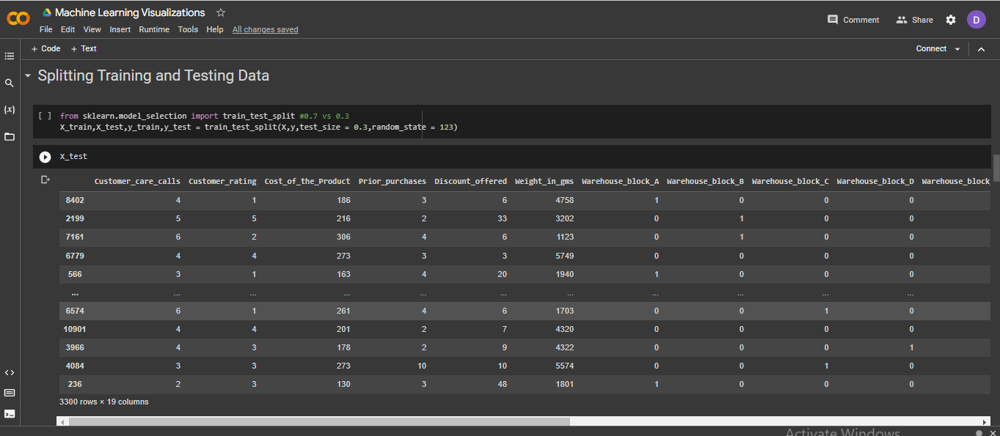
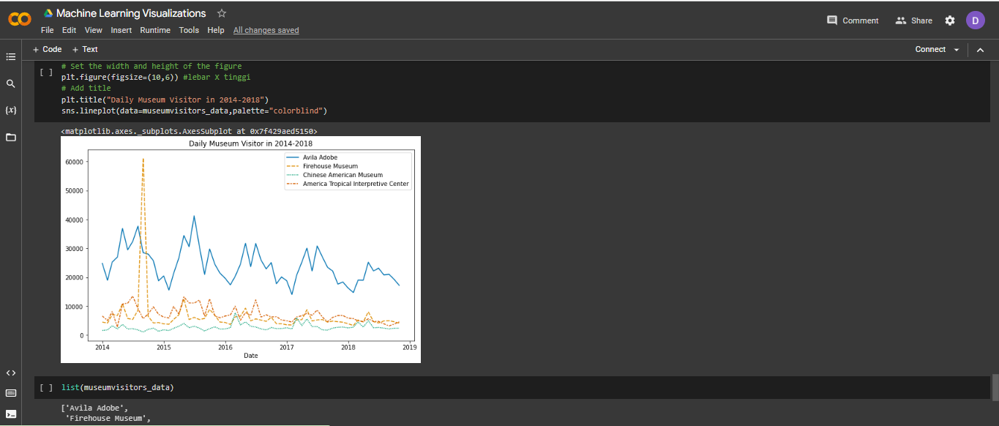
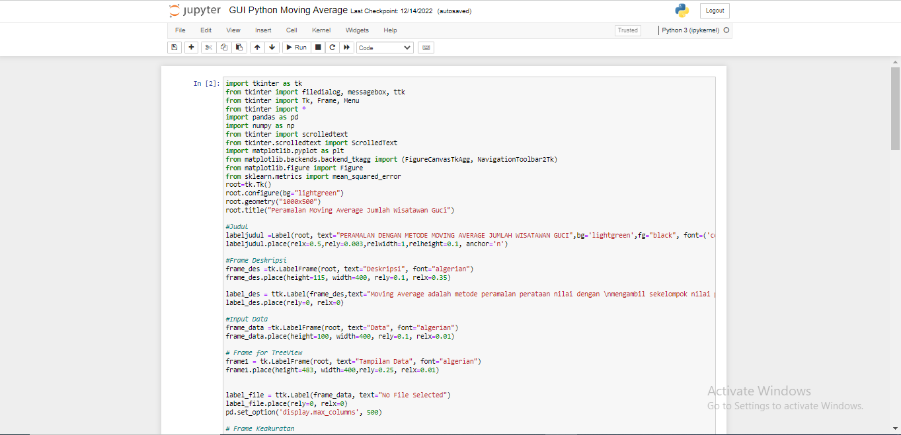
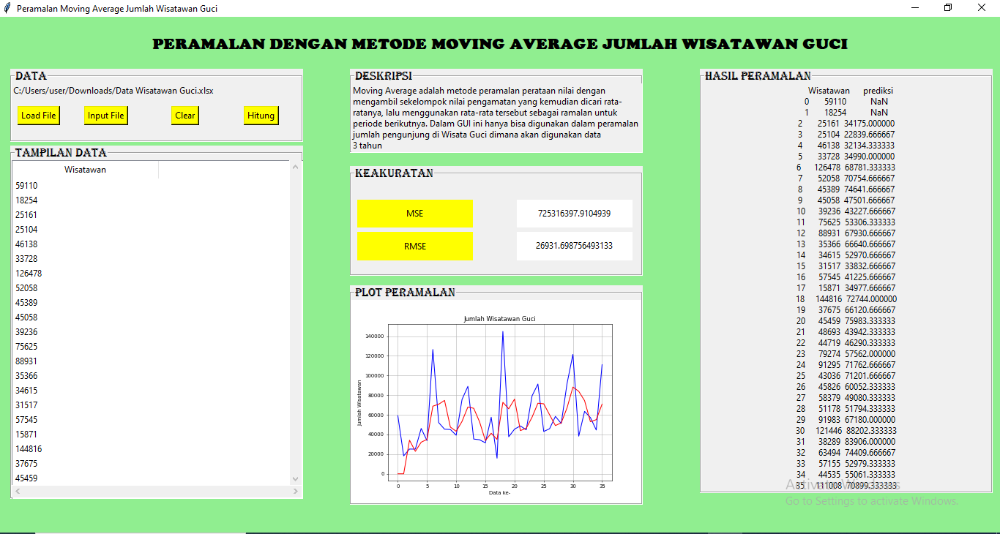

# Data Analytics
---
## Python Structure and Data Type

The basic Python data structures in Python include lists, sets, tuples, and dictionaries. Each data structure is unique in its own way. Data structures are "containers" that organize and group data by type. The data type can also perform number operations. 

 

 

---
## GUI Python for Moving Average (Data : Jumlah Wisatawan Gucci)

 The moving average is a statistical method used for forecasting long-term trends. The technique represents taking an average of a set of numbers in a given range while moving the range.

 

 A GUI (graphical user interface) is a system of interactive visual components for computer software. A GUI displays objects that convey information, and represent actions that can be taken by the user.

 
The steps to Use the Moving Average GUI 
1. Click the Input File button 
2. Choose file "Jumlah Wisatawan Gucci" 
3. Load file 
4. Click the Hitung button

 

 

---
