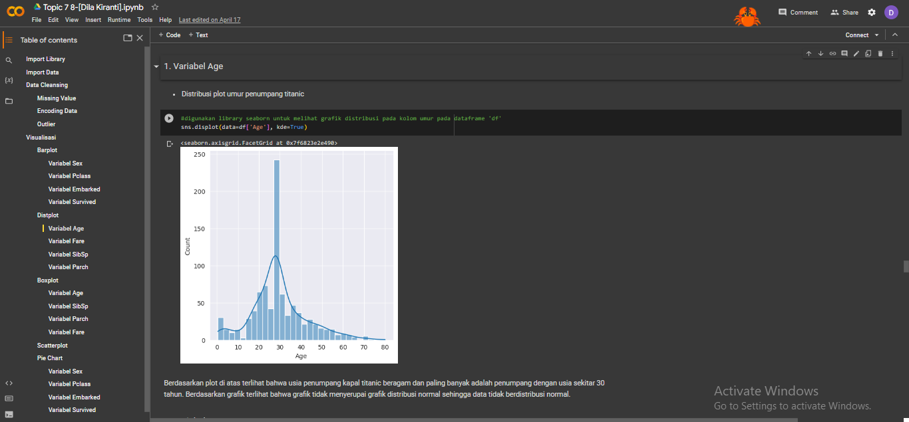
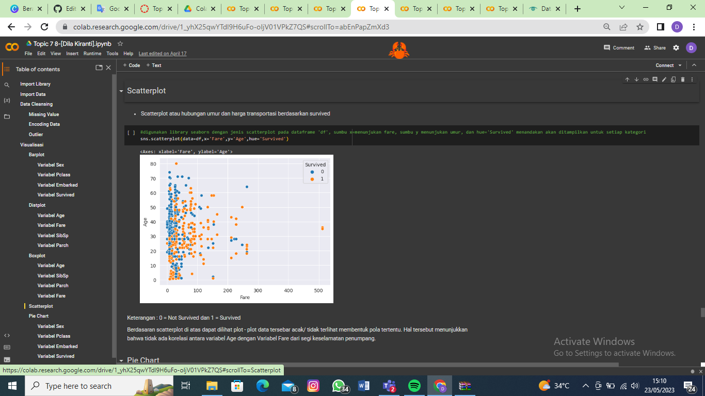
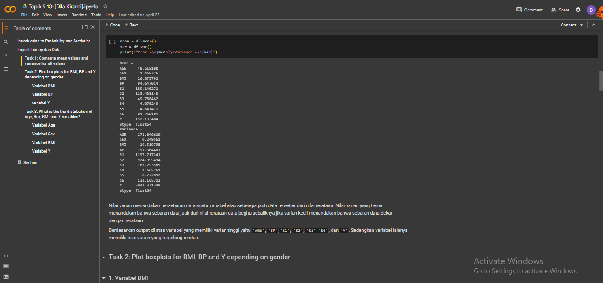
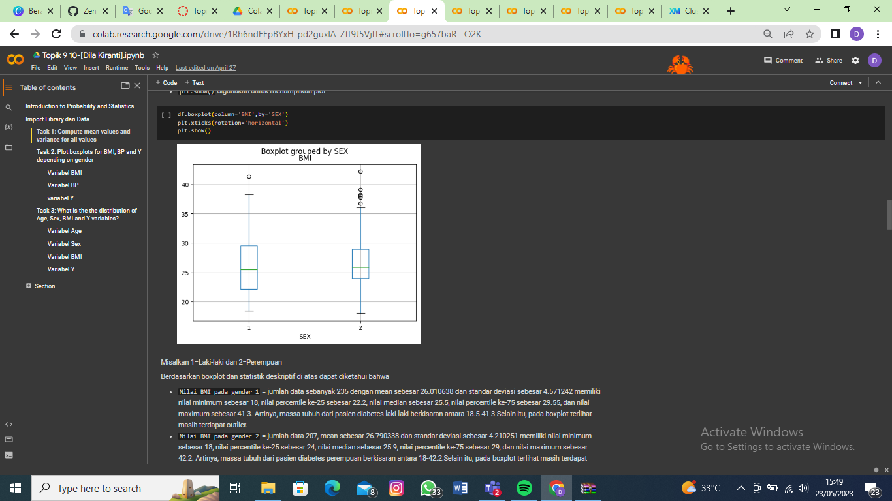
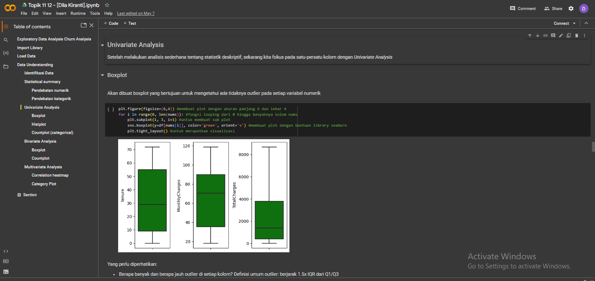
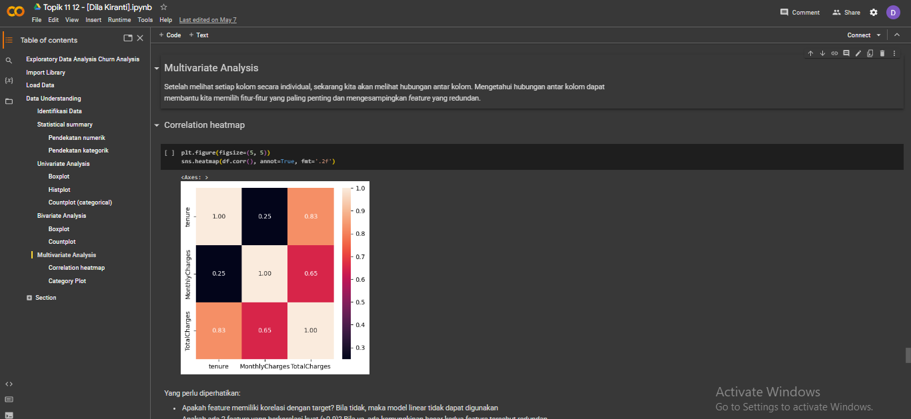
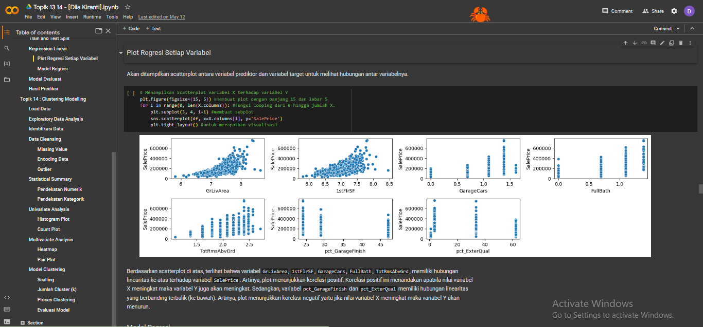
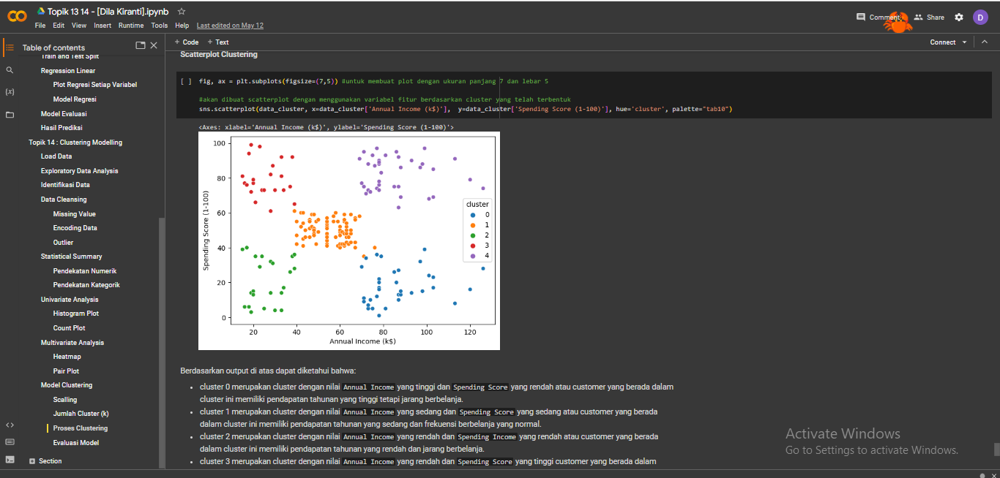

# Data Analytics
---
## Python Structure and Data Type

The basic Python data structures in Python include lists, sets, tuples, and dictionaries. Each data structure is unique in its own way. Data structures are "containers" that organize and group data by type. The data type can also perform number operations. 

 

 

---
## Data Cleansing with Python (Case : Telco Churn)

 Data cleansing is the process of correcting or removing incorrect, corrupted, malformed, duplicate, or incomplete data in a data set. In this dataset there are several stages of data cleansing:

 
The steps to Use the Moving Average GUI 
1. Missing value checking and handling 
2. Categorical data encoding 
3. Outlier handling

 

 

---
## Data Preprocessing with Pandas

 Data pre-processing is the data preparation component, describes all the types of processing performed on raw data to prepare it for other data processing procedures. Usually this can be done by combining 2 variables at different data sources with the merge function or filtering data to simplify the analysis process.

 

---

## Data Vizualisation with Python (Case : Ship Accident Data)

 Data visualization aims to help users understand large and complex information in a more understandable and engaging way. Many types of visualization data such as barplot, boxplot, scatterplot, heatmap, and many more with packages such as matplotlib, seaborn, or bokeh.

 

 

---
## Statistics with Python

 Statistics in data analysis is used to see the relationship between variables so that appropriate modeling can be done to obtain accurate prediction results.

 

 

---
## Exploratory Data Analysis (Case : Diabetic patient data)

 Exploratory Data Analysis refers to the critical process of performing initial investigations on data so as to discover patterns,to spot anomalies,to test hypothesis and to check assumptions with the help of summary statistics and graphical representations.

 

 

---
## Regression and Clustering with Python ( Case Regression : House Price Data & Clustering : Mall Customer Data)

 Regression analysis is a set of statistical methods used to estimate relationships between a dependent variable and one or more independent variables.

 

 Cluster analysis is a statistical method for processing data. It works by organizing items into groups, or clusters, on the basis of how closely associated they are.

 

 

