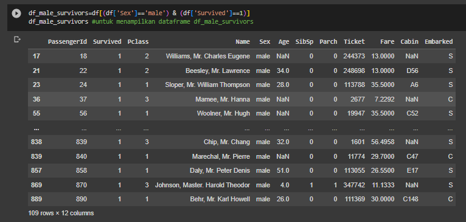
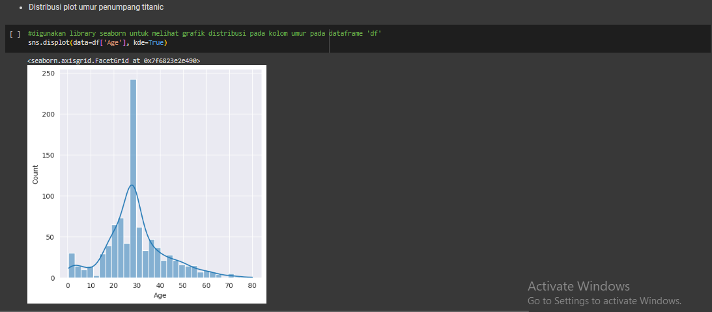

# Portfolio

## Skills and Abilities

1. Microsoft Excel/Google Spreedsheet 
2. Programming Languages : SQL, Python, Google Colab, and R 
3. Data Visualization : Lookers Studio 
4. Statistics : Descriptive Statistics, Exploratory Data Analysis and Visualization, Cluster Analysis, Regression Analysis, and Corelation Analysis 
5. Data Comunication Skills

 

## Data Visualization Project with Looker Studio 
### Global Covid-19 Cases Dashboard
View in Looker - [Global Covid-19 Cases Dashboard](https://lookerstudio.google.com/reporting/34e1e933-88ed-49bb-9ed9-7243a6957755)
 

 
### Report of Customer Mall Dashboard 
View in Looker - [Report of Customer Mall Dashboard](https://lookerstudio.google.com/reporting/e2eb8b28-d400-4f90-8c12-0b9f8ed545e2)
 

 

## SQL Project

By using PostrageSQL, several variables will be searched as follows: 
1. The top 10 customers and their email so we can reward them. 
2. The bottom 10 customers and their emails. 
3. The most profitable movie genres (ratings). 
4. The number of movies were returned late, early, and on time. 
5. The customer base in the countries where we have a presence. 
6. The most profitable country for the business. 
7. The average rental rate per film genre (rating).

 

 

## Python Project
### Data Cleansing in Python

 
Using Telco Churn data, data cleaning has been carried out with the aim of:

1. Missing value checking and handling 
2. Categorical data encoding 
3. Outlier handling

 

 
### Data Preprocessing with Pandas

 In this project, data preprocessing is done using the join, merge, delete, rename, group by, and aggregation functions. Usually this can be done by combining 2 variables at different data sources with the merge function or filtering data to simplify the analysis process.

 

 
### Data Vizualisation with Python

 Data visualization aims to help users understand large and complex information in a more understandable and engaging way. Using ship accident data, visualization is carried out as follows:

1. barplot: plot of the number of passengers based on gender, Pclass, Embarked, and Passenger safety. 
2. boxplot: distribution plot of age, number of siblings, number of families, and passenger fare. 
3. Scatterplot: plot of the relationship between passenger age and fare. 
4. Pie chart: number of passengers based on gender, Pclass, Embarked, and passenger safety.

 

 
### Statistics with Python

 Statistics in data analysis is used to see the relationship between variables so that appropriate modeling can be done to obtain accurate prediction results. Using data on diabetes patients, several things are done statistically, including:

1. Descriptive statistics: mean, median, mode, variance. 
2. Boxplot to find out the distribution of data and the number of outliers. 
3. distribution plot to determine the distribution of a variable and the distribution of the data.

 

 
### Exploratory Data Analysis

 Exploratory Data Analysis refers to the critical process of performing initial investigations on data so as to discover patterns,to spot anomalies,to test hypothesis and to check assumptions with the help of summary statistics and graphical representations. Using telco churn data, Exploratory Data Analysis and Visualization are carried out to find out: 
1. Statistical Summary: numerical and categorical approach. 
2. Univariate Analysis: to find out the distribution of data on numerical data and the number of categorical variables. 
3. Bivariate Analysis: to determine the relationship between 2 variables. 
4. Multivariate Analysis: To determine the correlation between data with a large number of variables using a heatmap.

 

 
### Regression and Clustering with Python 

1. Regression Analysis

Using house price data, a prediction model will be carried out to find out house prices using regression analysis. Analysis will be carried out by: 
1. split data train and testing. 
2. Create a predictive model with linear regression using train data. 
3. Evaluate the model using data testing with the values of Mean Absolute Error, Mean Square Error, Root mean Square Error, Mean Absolute Presentage Error, and R-Square.

 

2. Cluster Analysis

Using mall customer data, cluster analysis is carried out with the aim of knowing customer segmentation based on income and spending scores. This analysis is carried out by carrying out the following stages: 
1. Scaling data: aims to equate units between variables. 
2. Determining the number of clusters: Elbow and Silhouette methods. 
3. Data clustering. 
4. Model evaluation: Silhouette Coefficient, Calinski-Harabasz Index and Davies-Bouldin Index.

 

 

